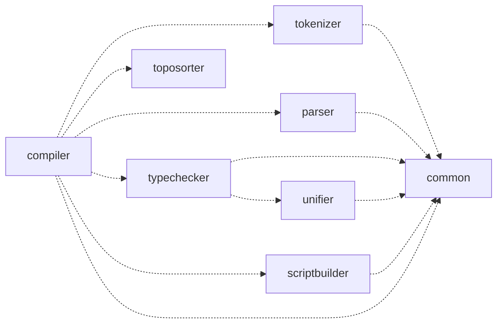

# CLAUDE.md

This file provides guidance to Claude Code (claude.ai/code) when working with code in this repository.

## Project Overview

This project contains the reference implementation for the hop language.

hop is a HTML-like templating language with built-in type checking.

The reference implementation is divided into modules where each file
corresponds to a module.

The modules are the following:

* `src/common.rs` - The `common` module. This module contains data structures and utility functions shared across the other modules in the project.
* `src/tokenizer.rs` - The `tokenizer` module. This module contains the specification for the public API and the implementation of the hop tokenizer.
* `src/parser.rs` - The `parser` module. This module contains the specification for the public API and the implementation of the hop parser.
* `src/unifier.rs` - The `unifier` module. This module contains a specification for a class that performs unification.
* `src/typechecker.rs` - The `typechecker` module. This module contains the specification for the public API and the implementation of the hop typechecker.
* `src/toposorter.rs` - The `toposorter` module. This module contains a class that performs topological sorting of directed graphs.
* `src/compiler.rs` - The `compiler` module. This module contains the specification for the public API and the implementation of the hop compiler that compiles hop modules into executable programs.

The following diagram shows how the modules relate to each other in terms of imports:



## Transpiling to TypeScript

You may be asked to transpile the project to TypeScript. If you are asked to do
this you are expected to output the code to a single file. Use the same
visibility for exports as in Rust. E.g. given that a module `foo` only exports
a single function `foo_fn`, only that function should be exported from the
TypeScript file.

You may be asked to transpile the whole project to TypeScript, if asked to do
this, put the output in a file named `hop.ts`. You may also be asked to
transpile a single module, if asked to do this name the file to whatever the
module name is. I.e. if asked to transpile the `parser` module, name the file
`parser.ts`. When transpiling a single module, only include the transitive
dependencies of the module (e.g. if transpiling a module `foo` that has a
single dependency `bar` that has no dependencies, only include the `foo` and
`bar` module in the output).

## TypeScript Implementation Guide

### Convert snake case to Pascal case or camel case where appropriate

E.g. if a function is declared as `pub fn foo_bar` it should
be declared as `export function fooBar` in TypeScript.

### Implementing optional types (`Option<_>`)

When a type is declared as `Option<Foo>` the TypeScript implementation should
use `Foo | null`.

### Implementing the `Node` type

When implementing the Node type in TypeScript, use the following definition:


```typescript
export enum NodeKind {
  DoctypeNode = "DoctypeNode",
  TextNode = "TextNode",
  RenderNode = "RenderNode",
  // ...
}

export class DoctypeNode {
  readonly kind = NodeKind.DoctypeNode;
  constructor(...) {}
}

export class TextNode {
  readonly kind = NodeKind.TextNode;
  constructor(...) {}
}

export class RenderNode {
  readonly kind = NodeKind.RenderNode;
  constructor(...) {}
}

// ...

export type Node =
  | DoctypeNode
  | TextNode
  | RenderNode
  | // ...
```

### Implementing the `Type` type

Use the following definitions when implementing the `Type` type:

```typescript
export enum TypeKind {
  ObjectType = "ObjectType",
  ArrayType = "ArrayType",
  BoolType = "BoolType",
  StringType = "StringType",
  VoidType = "VoidType",
  TypeVarType = "TypeVarType",
}

export class ObjectType {
  readonly kind = TypeKind.ObjectType;
  constructor(
    readonly properties: ReadonlyMap<string, Type>,
    readonly rest: number,
  ) {}

  toString(): string {
    // ...
  }
}

export class ArrayType {
  readonly kind = TypeKind.ArrayType;
  constructor(readonly type: Type) {}

  toString(): string {
    // ...
  }
}

export class BoolType {
  readonly kind = TypeKind.BoolType;

  toString(): string {
    // ...
  }
}

export class StringType {
  readonly kind = TypeKind.StringType;

  toString(): string {
    // ...
  }
}

export class VoidType {
  readonly kind = TypeKind.VoidType;

  toString(): string {
    // ...
  }
}

export class TypeVarType {
  readonly kind = TypeKind.TypeVarType;
  constructor(readonly id: number) {}

  toString(): string {
    // ...
  }
}

export type Type =
  | ObjectType
  | ArrayType
  | BoolType
  | StringType
  | VoidType
  | TypeVarType;
```

### Never use Type Assertions

You should never use type assertions in TypeScript (the `as` keyword). Instead,
use the fact that TypeScript does type narrowing for discriminated unions. If
you do not think it is possible to implement the code without a type assertion,
abort immediately and explain why a type assertion is needed.

### Prefer to use define fields in constructors when possible

You should prefer to write

```typescript
class ParseError {
  constructor(
    public message: string,
    public start: Position,
    public end: Position,
  ) {}
}
```

Rather than:

```typescript
class ParseError {
  message: string;
  start: Position;
  end: Position;

  constructor(message: string, start: Position, end: Position) {
    this.message = message;
    this.start = start;
    this.end = end;
  }
}
```

### Use double quotes for strings

You should prefer to use double quotes for strings, i.e. write:

```typescript
if (char === ">")
```

rather than:

```typescript
if (char === '>')
```
